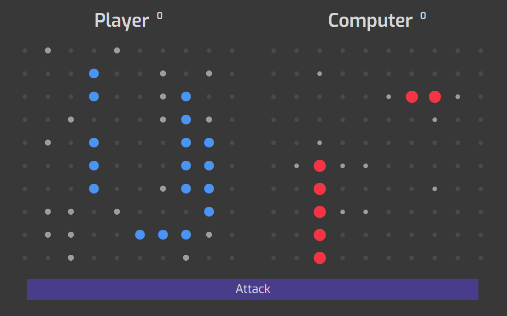

# Odin Battleship

> Implementation of the classic game 'Battleship' in JavaScript using Test Driven Development methodology.



## Built With

- [webpack](https://webpack.js.org/)
- [jest](https://handlebarsjs.com/)

## Live Demo

[Live Demo Link](https://raw.githack.com/juzQrios/odin-battleship/battleship/dist/index.html)

## Getting Started

Run these commands:

```bash
git clone git@github.com:juzQrios/odin-battleship.git
cd odin-battleship
npm install
npm run build-prod
```

Then Open `index.html` inside `/dist` folder in your browser.

### Run tests

```npm run test a```

#### UI Design Inspiration

[UI](https://dribbble.com/shots/2329326-Battleship-for-iOS)

## Authors

- [Darshan](https://github.com/juzQrios)
- [Muhammad](https://github.com/mosaaleb)
